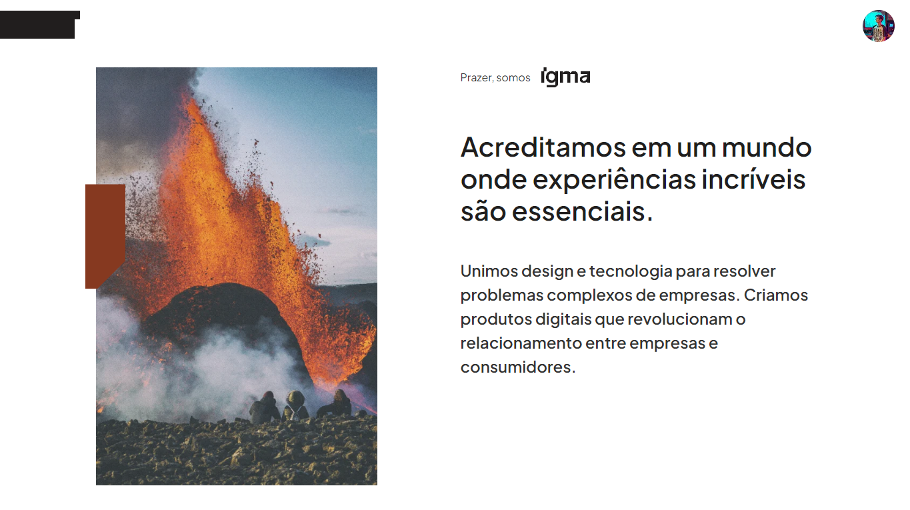
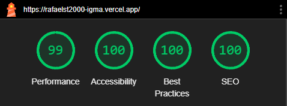

  
  

&nbsp;

![Node_Badge][node_version_badge] ![next_Badge][next_badge] ![NodeJS_Badge][typescript] ![styled][styled]

## **:rocket: Objetivo**

Este projeto foi desenvolvido como **Teste técnico** da empresa **Igma**. Consiste em uma página web responsiva.

## **:computer: Tecnologias**

- **NextJS - Framework para o ReactJS**
- **Typescript - Superset do Javascript**
- **Phosphor React - Biblioteca de ícones**
- **Stitches - CSS in JS**
- **OAuth2 - Auth**
- **NextAuth - Biblioteca de autenticação do NextJS**

## **📩 Commits**

- Seguindo o padrão do *Conventional Commits*

## **⚡Executando o projeto em ambiente de Produção**

Acesse [https://motoways.vercel.app/](https://rafaelst2000-igma.vercel.app/) pelo seu navegador.

   

  Made by <a href="https://www.linkedin.com/in/rafaelst2000/" target="_blank">Rafael Trevisan</a>

<!-- Badges -->

[node_version_badge]: https://img.shields.io/badge/Node-18.17.1-green
[next_badge]: https://img.shields.io/badge/Web-NextJS-blue
[typescript]: https://img.shields.io/badge/TS-Typescript-blue
[styled]: https://img.shields.io/badge/CSS-Stitches-yellow
